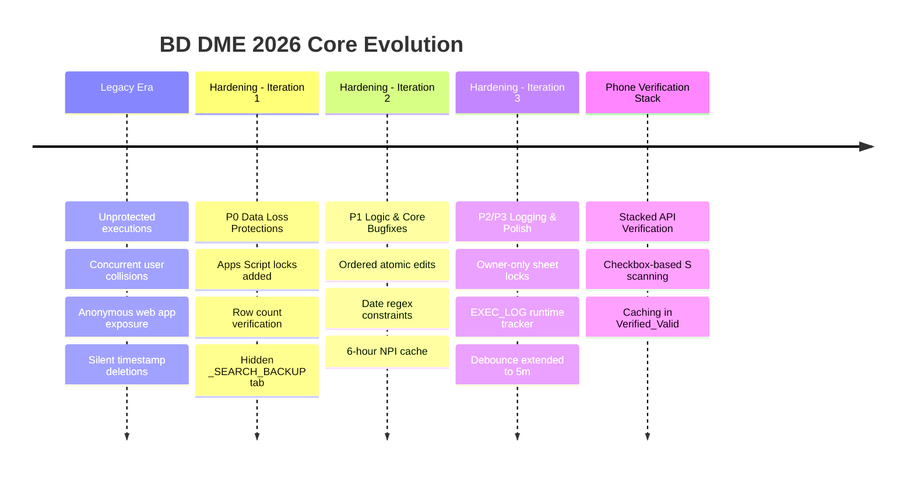

# System History & Evolutionary Timeline (BD DME 2026)

This document provides a detailed account of the **BD DME 2026** platform's technical history, from its origin as a fragile, single-user sheet to its current state as a hardened, high-concurrency database automation platform.

---

## 📜 Architectural Evolution Timeline

---

## 🛑 Phase 1: The Legacy Era (Unprotected & Fragile)

Before the modernization initiative, the sheet was shared among 4 dialers simultaneously, which led to frequent operational bottlenecks:
* **Concurrent Overwrite Collisions:** When two dialers clicked **Run Master Search** close to each other, the second run started before the first completed, reading outdated data. The last write would win, silently erasing the first dialer's search outputs.
* **Blind Writes:** The Master Search script read data, processed it, and blindly wrote it back to the sheet. If a dialer inserted or deleted a row while the search was running, the data would write back to shifted rows, corrupting historical entries.
* **Open Security Vulnerability:** The Apps Script Web App was deployed with `access: ANYONE_ANONYMOUS`, exposing execution privileges to any unauthorized external call.
* **Destructive Timestamp Formatting:** The deduplication tools threw away any handwritten, non-standard timestamps, resulting in permanent losses of valid historical commentary logs.

---

## 🛡️ Phase 2: The Hardening Initiative

To secure the sheet for multiple concurrent dialers, a multi-phase **Hardening Plan** was successfully implemented:

### 1. Iteration 1 — Stop Data Loss (P0) ✅
* **Apps Script Mutual Exclusion Lock:** Integrated a script lock via `LockService.getScriptLock()` inside `runMasterSearchCore_`. If a dialer executes a search while another is active, they are cleanly locked out and see a brief, friendly "Busy" toast notification.
* **Shift Protection Validation:** Added a post-read validation checking if `currentLastRow - 1 === numRows` right before writing. If the row count changes, the write is aborted to protect data integrity.
* **Automated Rollback Backup:** Created the hidden `_SEARCH_BACKUP` tab. Prior to writing search results, Columns A-C are copied there, allowing instant restoration if an overwrite goes wrong.
* **Security Lockdown:** Changed Apps Script Web App execution access to `ANYONE` (requiring Google account authentication), immediately closing the anonymous access vulnerability.

### 2. Iteration 2 — Logic Bugfixes (P1) ✅
* **Ordered Atomic Writes:** In `_handleCommentEdit`, column writes were prioritized so that the audit trail (`Column Q` timestamp) is written first, followed by the comments (`Column F` date suffix). If a network timeout occurs mid-write, the audit log remains intact.
* **Accurate Date Boundaries:** Replaced fragile date boundary regexes with `(?:^|\s|\n)${month}\/${day}(?:\s|$|\n)`. This fixed bugs where a search for `1/1` would incorrectly flag a historical `11/12` comment.
* **Timestamp Preservation:** Rewrote the deduplication parser to isolate parseable dates from unparseable date strings. Unparseable entries are preserved at the bottom of Column Q rather than deleted.
* **Whitelist Protections:** Locked dangerous administrative tools like `capitalizeHeadersBatch` to a whitelisted array of tabs, blocking execution on tracking/backup sheets.
* **NPI API Caching:** Added a 6-hour TTL cache in `CacheService` for NPI queries, dramatically reducing latency and saving 99% of daily API quotas.
* **DNC Tab Search Integration:** Added the `DNC` (Do Not Call) worksheet to `lookupTabs` in both `runMasterSearch` and `runNewLabsMasterSearch` to seamlessly identify and flag DNC contacts in Column A.

### 3. Iteration 3 — Logging & Polish (P2/P3) ✅
* **Owner-Only Log Sheets:** Programmatically set `Protection` on logging worksheets. Only the spreadsheet owner can modify `LOGS` and `EXEC_LOG` tabs.
* **Execution Logs Tracker:** Connected `runWithExecutionLog_` wrappers around all heavy menu functions to trace runtime durations, triggers, execution IDs, and users in the `EXEC_LOG` sheet.
* **Cooldown Expansion:** Extended the lead routing dropdown cooldown to 5 minutes (300 seconds) in `CacheService` to prevent double-click duplicate lead copies.

---

## 📞 Phase 3: Automated Phone Verification Stack

To optimize dialer prospecting efficiency, a high-speed verification engine was integrated directly into the spreadsheet UI:
* **Stacked API Failovers:** Created a fallback system querying phone status across three distinct levels of API quality:
  1. **Antideo** (Free, no-key fallback)
  2. **APITier** (Commercial verification)
  3. **IP Quality Score** (High-fidelity carrier checks)
* **Checkbox On-Demand Processing:** Users mark checkboxes in Column S (`COL_VERIFY_CHECKBOX`) and trigger **Verify Selected Phones** from the custom menu.
* **Double-Layer Caching:** Verified active numbers are written to `Verified_Valid`, and dead lines are written to `Disconnected` as well as updated to "Dis/Wn" on active sheets. Subscriptions and quotas are preserved by checking caches first.

---
 sss
## 💡 Key Design Decisions & Rationale

### 1. Why `Africa/Cairo` Timezone?
While individual dialers may operate across different time zones, the primary operations base in Cairo, Egypt is the designated timezone standard (`Africa/Cairo`, UTC+2). This ensures that timestamp logs in Column Q and the execution audit trails align with headquarter reporting schedules.

### 2. Lock Timings
* **Lock Timeout (5 seconds):** When clicking Master Search, a 5-second lock timeout was chosen to fail fast. If another dialer is running a search, it is highly likely that they will hold the lock for 10-15 seconds. Failing fast prevents multiple browser windows from locking up in a freeze state.
* **Cooldown window (5 minutes):** The 5-minute routing cooldown represents the optimal balance between preventing user error double-clicks and allowing dialers to re-route leads if a customer changes their mind later in a shift.

### 3. Decoupling Logs from Critical Locks
A key performance optimization in `onedit.js` is writing action logs *outside* of the script lock. The critical script lock is held only during the actual timestamp and comments writes, and is released before the logging API call is made. This reduces lock contention and keeps the sheet highly responsive under load.
