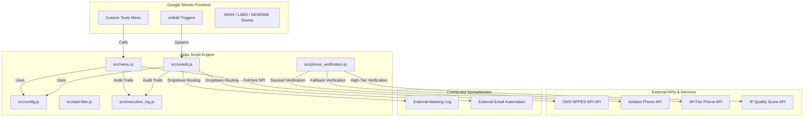

# Strategic Lead Generation & Dialer Automation Platform (BD DME 2026)

Welcome to the central documentation for the **BD DME 2026** spreadsheet automation platform. This system is a high-performance Google Sheets and Google Apps Script solution tailored for the Business Development team at **Gulf Global Outsourcing** and **Prime AD Solutions** in Cairo, Egypt.

The system serves as a mission-critical tool for dialers and BD executives managing outbound campaigns, including Customer Experience (CX), Virtual Assistants (VA), Healthcare/Durable Medical Equipment (DME), and various non-medical campaigns.

---

## 🗺️ Core Architecture

This platform turns Google Sheets into a high-concurrency multi-user database by layering programmatic safety, API intelligence, and real-time triggers onto traditional sheets.



---

## ⚡ Key Features

### 1. High-Concurrency Master Search
* **Script Locking:** Built-in `LockService` structures prevent dialers from overwriting each other's search queries if run concurrently.
* **Row-Count Validation:** Prior to writing output, the script re-checks row counts to verify that no rows were added or deleted during the search cycle, preventing data shifting.
* **`_SEARCH_BACKUP` Tab:** A hidden, automated backup tab snapshots Columns A-C prior to search execution, making data recovery trivial.

### 2. Stacked API Phone Verification
* **Multi-Tiered Verification:** Automatically checks phone numbers across multiple verification APIs: **Antideo** (free, no-key), **APITier** (commercial), and **IP Quality Score** (high-tier).
* **On-Demand Processing:** Users check the verification checkbox (Column S) and run **Verify Selected Phones** from the custom menu.
* **Local Sheet Caching:** Valid numbers are cached in the `Verified_Valid` tab, and disconnected lines are stored in `Disconnected` to eliminate redundant API calls and respect quotas.

### 3. Unified Edit Triggers & Auto-Routing
* **Auto-Date Comments:** Editing Column F (Comments) automatically appends the current date suffix to the line.
* **Chronological Timestamps:** Automatically records a history of comment timestamps in Column Q, sorted newest-to-oldest.
* **Lead Routing Dropdown:** Selection of dropdown values in Column P ("Send Lead to") routes the lead dynamically:
  * Copies rows to internal flag sheets (`Ben Flags`, `Jimmy Flags`, etc.).
  * Appends rows to an external **Meeting Log** spreadsheet.
  * Appends rows to an external **Email Automation** sheet.
* **Debounce Protection:** Incorporates a 5-minute (300s) row-level edit cooldown to prevent duplicate routing triggers.

### 4. Dynamic DME/Labs Filter Views
* **Expanded Keyword Matching:** Scans the `ReferenceToCancel` sheet, splits multi-word phrases (e.g. "Adult Daycare" into `Adult` and `Daycare`), and programmatically builds strict filter views for DME and Lab dialer views.

---

## 📂 Code Directory Layout

All script files reside in the `src/` directory, facilitating simple workspace organization and version control syncing via `clasp`:

* **[src/config.js](file:///c:/Users/ben.arthur/Desktop/BD%20MAIN%202026/src/config.js)**: The single source of truth for column index definitions, trigger columns, and external spreadsheet configurations.
* **[src/menu.js](file:///c:/Users/ben.arthur/Desktop/BD%20MAIN%202026/src/menu.js)**: Holds the custom sheets menu (`onOpen`) and primary data manipulation utilities (Master Search, timestamp deduplication, cell unmerging).
* **[src/onedit.js](file:///c:/Users/ben.arthur/Desktop/BD%20MAIN%202026/src/onedit.js)**: Custom edit hook (`onEditInstallable`) managing automatic dates, comments history, and dropdown lead routing.
* **[src/phone_verification.js](file:///c:/Users/ben.arthur/Desktop/BD%20MAIN%202026/src/phone_verification.js)**: Logic engine for stacked phone verification, checkbox scanning, and caching.
* **[src/add filter.js](file:///c:/Users/ben.arthur/Desktop/BD%20MAIN%202026/src/add%20filter.js)**: Programmatic generation of filter views using keywords.
* **[src/execution_log.js](file:///c:/Users/ben.arthur/Desktop/BD%20MAIN%202026/src/execution_log.js)**: Logging wrappers that trace system function calls, runtimes, executing users, and status values inside `EXEC_LOG`.
* **[src/commentTask.js](file:///c:/Users/ben.arthur/Desktop/BD%20MAIN%202026/src/commentTask.js)**: Integrates comment annotations (`@task(...)`) directly with Google Tasks (paused for performance tuning).
* **[src/npisearch.js](file:///c:/Users/ben.arthur/Desktop/BD%20MAIN%202026/src/npisearch.js)**: Custom spreadsheet function `=bgetnpi()` for batch NPI metadata retrieval with a 6-hour local cache.
* **[src/script_catalog.js](file:///c:/Users/ben.arthur/Desktop/BD%20MAIN%202026/src/script_catalog.js)**: Dynamic metadata manager that builds a descriptive `SCRIPT_CATALOG` worksheet in Google Sheets.

---

## 🚀 Setup & Deployment

### Prerequisite Configuration
Ensure the following API services are enabled within the Apps Script editor project:
1. **Google Sheets API v4** (Advanced Google Service)
2. **Google Tasks API v1** (Advanced Google Service - if unpausing tasks integration)

### Deployment Steps
1. Configure your Google Apps Script project settings in `.clasp.json`.
2. Sync the codebase files in the `src/` directory to the script container:
   ```bash
   clasp push
   ```
3. Set up the installable trigger in the Apps Script project UI:
   * **Function to Run:** `onEditInstallable`
   * **Deployment:** `Head`
   * **Event Source:** `From spreadsheet`
   * **Event Type:** `On edit`
4. Run the function `setupDailyTriggers` manually once in the Apps Script editor to establish the automated daily trigger suite.

---

## 🔒 Security & Environment Guardrails

* **Access Restrictions:** The Web App deployment in `appsscript.json` is configured with `"access": "ANYONE"` to demand Google account authentication for execution, blocking anonymous execution.
* **Protected Worksheets:** System critical log tabs (`LOGS` and `EXEC_LOG`) are locked down to owner-only permissions programmatically on creation, preventing unauthorized tampering by other sheet users.
* **Timezone Standard:** All spreadsheet logs and comment timestamps are generated relative to the `Africa/Cairo` timezone (UTC+2) to match headquarter operations.

---

## 📖 Further Reading

| Doc | Description |
|:---|:---|
| [INDEX.md](./INDEX.md) | Full tab, column, and code module reference |
| [HISTORY.md](./HISTORY.md) | Evolutionary timeline and key design decisions |
| [docs/CONTRIBUTING.md](./docs/CONTRIBUTING.md) | Development workflow, code rules, and pre-push checklist |
| [docs/CODE_DOCUMENTATION.md](./docs/CODE_DOCUMENTATION.md) | Detailed per-function documentation |
| [docs/OBSERVABILITY_SETUP.md](./docs/OBSERVABILITY_SETUP.md) | `EXEC_LOG` and `LOGS` setup guide |
| [docs/GCP_AUTH_GUIDE.md](./docs/GCP_AUTH_GUIDE.md) | GCP OAuth and API credentials guide |
